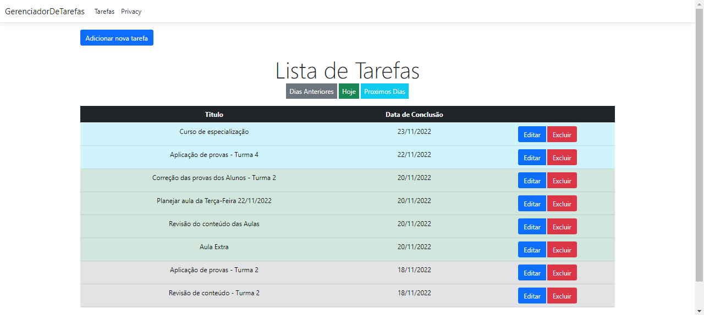
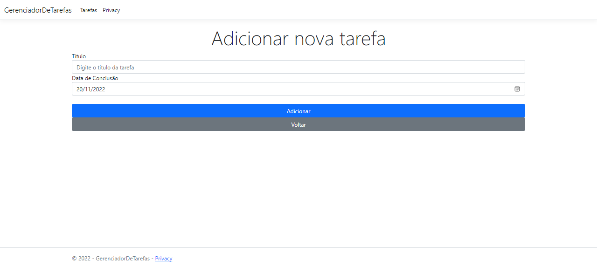
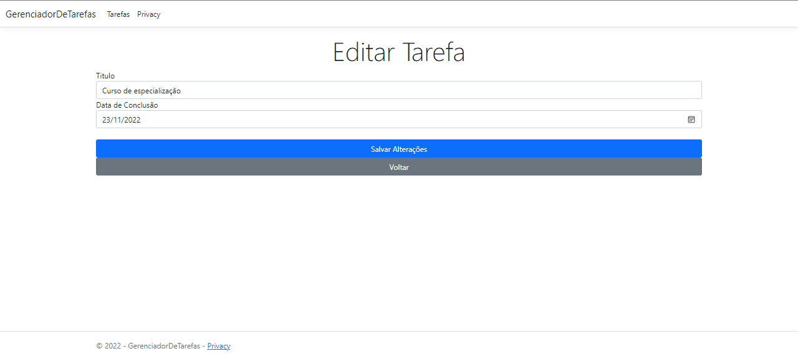
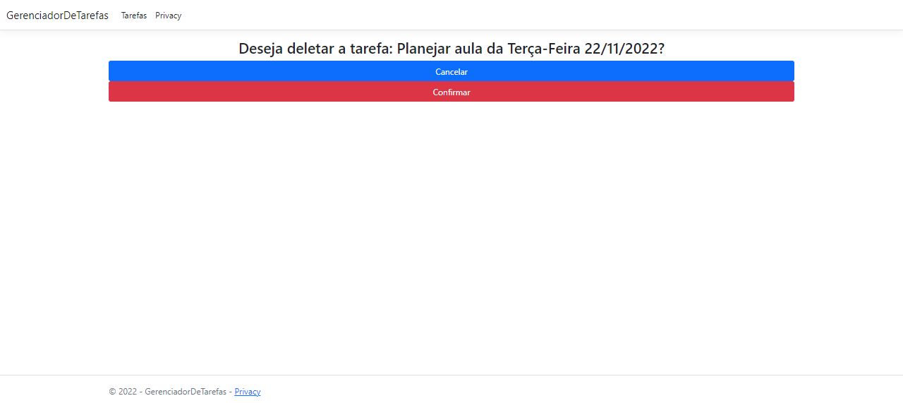

# Gerenciador de tarefas

Aplicação web feita para o desafio tecnico para desenvolver .NET Junior da Assino. 
A aplicação tem como objetivo gerenciar as tarefas de um professor, fornecendo as funcionaldiades de criação, edição, exclusão e listagem.
Foram utilizados no desenvolvimento o Microsoft .Net Framework 6.0, o Entity Framework e o SQL Server como banco de dados.

### * Alguns funcionalidades que o aplicativo possui *

 - Tela inicial com uma lista de todas as tarefas ja cadastradas.
 - As tarefas estão divididas em 3 categorias: Tarefas de dias anteriores , do dia atual e dos dias seguintes, cada categoria identificada com uma cor.
 - Criação, Edição e Exclusão de tarefas.

### Como executar a aplicação
É necessario ter instalado o Microsoft .Net Framework 6.0 e o SQL Server.

-> Inicialmente, fazer um clone do repositorio para a sua maquina local:
```console
git clone https://github.com/ElexandroTorres/Gerenciador-de-Tarefas
```
-> Após clonado, abrir o projeto na IDE de sua preferencia. 
-> Acessar o arquivo appsettings.json localizado na pasta principal do projeto.
-> Ao abrir o arquivo, é necessario mudar a string de conexão, para que ela referencie o seu banco de dados. Mudando o nome do Server, do banco de dados assim como o Id do usuario e senha do seu SQL Server.

```json
  "ConnectionStrings": {
    "Database" : "Server=DESKTOP-NP2P85H\\SQLEXPRESS;Database=DB_TaskManager;User Id=sa;Password=elex123;Encrypt=False"
  },
```
-> Após feitas as alterações, é necessario gerar o banco e as tabelas do projeto no seu SQL SERVER, para isso é preciso executar uma migration.
-> No console do gerenciador de pacotes, use os seguintes comandos:
```console
  Add-Migration NomeParaMigration -Context AppDbContext
```
-> Logo depois
```console
  Update-Database -Context AppDbContext
```
Se tudo foi feito corretamente. O projeto está pronto para ser executado e utilizado.

### Telas da aplicação

<p float="left">

 

 

 

 

</p>